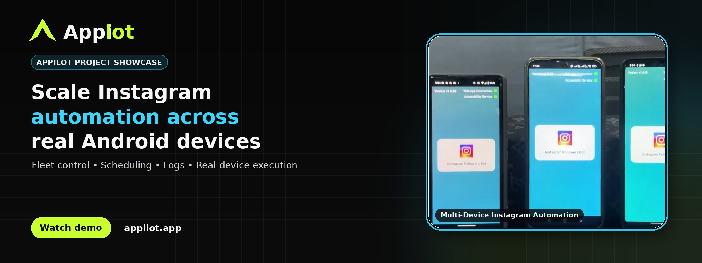
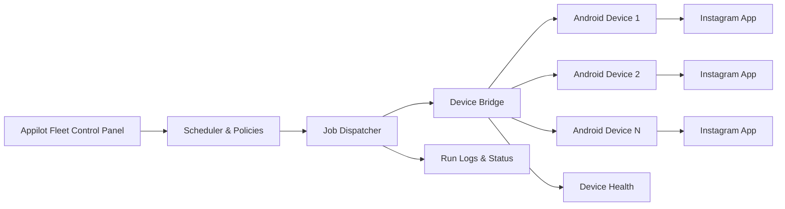
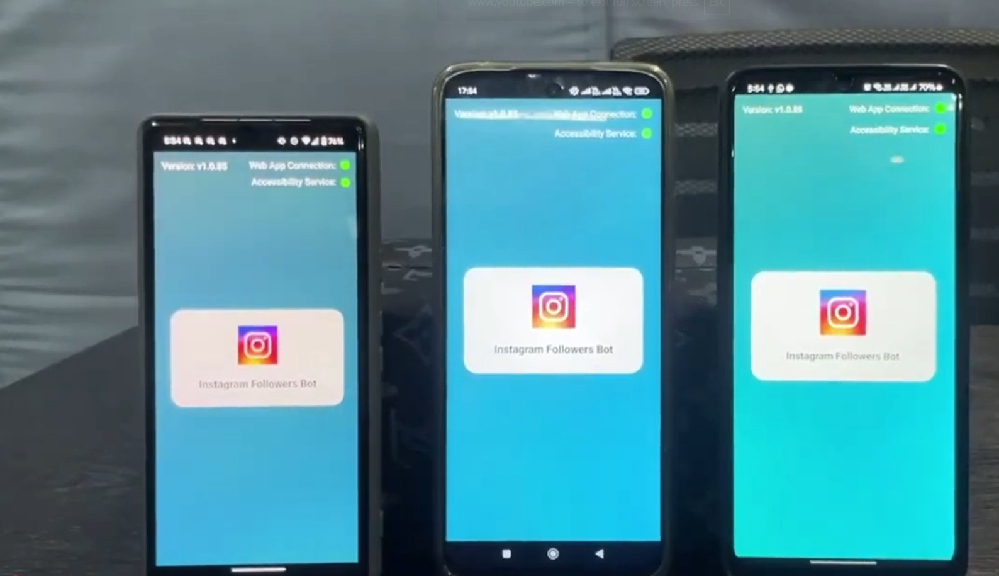
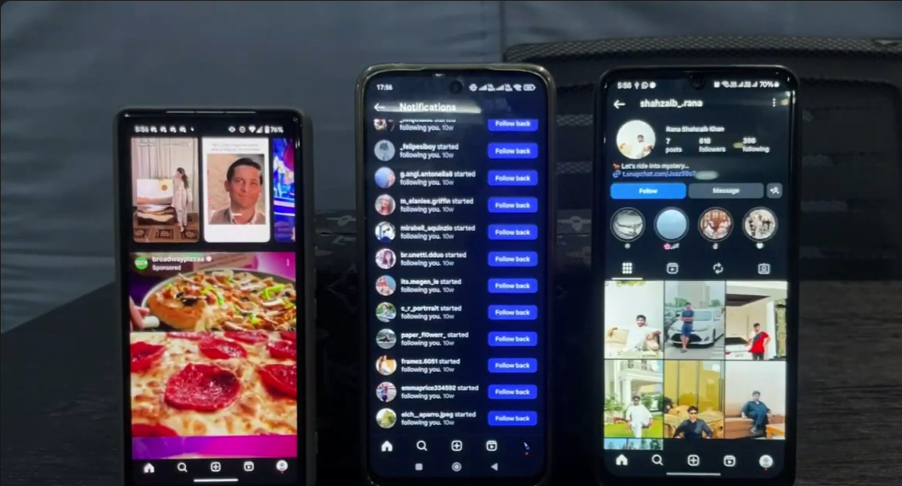
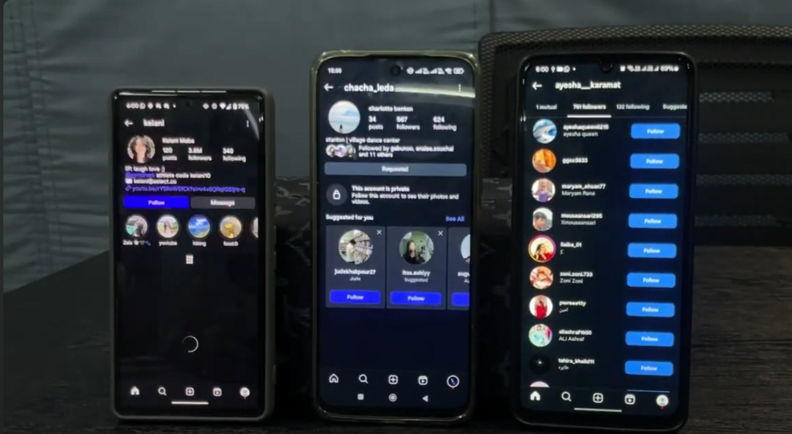

# Instagram Automation System for Multiple Devices

[](https://www.appilot.app/) [](https://youtu.be/txEfGvncHTk)

## Demo Video

[](https://youtu.be/txEfGvncHTk)

**Watch on YouTube:** https://youtu.be/txEfGvncHTk

## Overview

A real-device Instagram automation across multiple Android phones, with centralized scheduling, fleet control, and operational logs. The project was built as a custom Appilot engagement to coordinate mobile workflows from a central operations layer while keeping device state, scheduling and run visibility easy for an operator to review.

## Core Capabilities

| Capability | What it provides |
|---|---|
| **Centralized fleet control** | Register, view and coordinate multiple physical Android devices from one operational dashboard. |
| **Account-to-device mapping** | Associate managed Instagram accounts with specific devices and execution policies. |
| **Scheduled automation** | Queue approved workflows by device, account and time window. |
| **Real-device execution** | Run mobile workflows in the native Instagram app on physical Android hardware. |
| **Operational visibility** | Track device availability, active processes, historical runs and error logs. |
| **Custom workflow layer** | Extend the system for organization-specific posting, navigation, QA or campaign operations. |

## Architecture




## Workflow

1. Register authorized Android devices in the fleet control panel.
2. Assign managed accounts and define workflow policies.
3. Schedule approved jobs and dispatch them to available devices.
4. Execute the workflow in the native mobile app.
5. Capture run status, errors and device-health signals for operators.

## Screenshots

<table align="center">
  <tr>
    <td align="center" width="33%">
      
      <br><br>
      <b>1.</b> Instagram automation running across three Android devices
    </td>
    <td align="center" width="33%">
      
      <br><br>
      <b>2.</b> Multiple Android devices showing active Instagram workflows
    </td>
    <td align="center" width="33%">
      
      <br><br>
      <b>3.</b> Instagram following workflow across multiple real Android devices
    </td>
  </tr>
</table>


## Repository Contents

```text
appilot-instagram-multi-device-automation/
├── README.md
├── ARCHITECTURE.md
├── DEMO.md
├── REPOSITORY-SETUP.md
├── RESPONSIBLE-USE.md
├── LICENSE.md
├── repo-metadata.json
├── .gitignore
├── .github/
│   └── ISSUE_TEMPLATE/
│       └── config.yml
└── assets/
    ├── banner.png
    └── screenshots/
        ├── 01-instagram-followers-bot-multiple-devices.png
        ├── 02-instagram-live-activity-multiple-devices.png
        └── 03-instagram-following-workflow-multiple-devices.png
```

## Want a Custom Version?

Appilot builds custom mobile automation systems around real-device fleets, operational dashboards and business-specific workflows. If your process requires a tailored device setup, scheduling layer, integrations or reporting, discuss the scope with the Appilot team.

**Website:** https://www.appilot.app/

